# Lab3Web
| Nama      | Lydia Diffani Siregar |
| ----------- | ----------- |
| NIM     | 312010498       |
| Kelas   | TI.20.A.1        |

## Langkah langkah praktikum 3
Persiapan membuat dokumen HTML dengan nama file <strong> lab3_list.html </strong> seperti berikut.
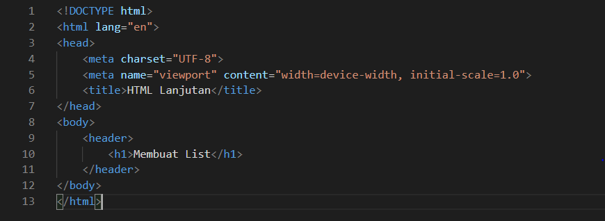
Ini hasil di Microsoft Edge nya
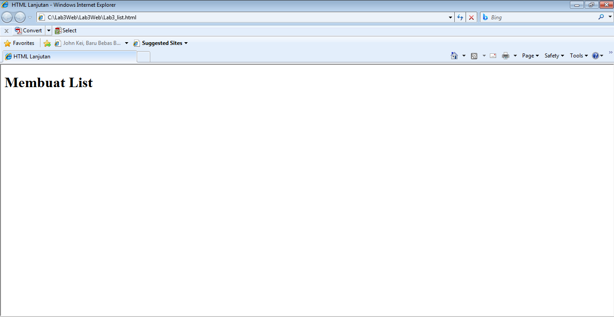

<strong> Membuat Ordered List </strong>
Kemudian tambahkan kode untuk membuat Ordered List seperti berikut.
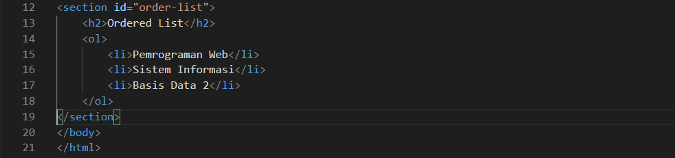
Ini hasil di Microsoft Edge nya
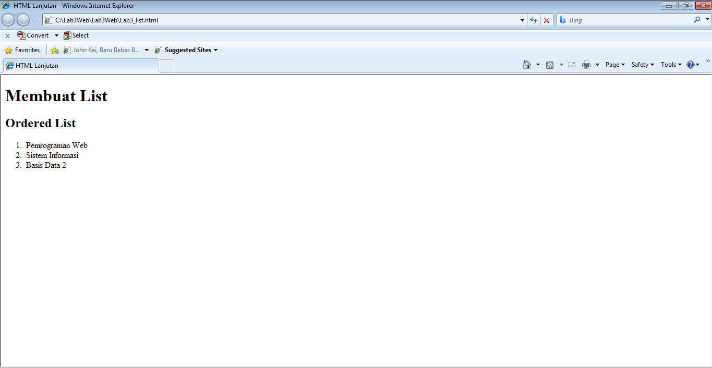

<strong> Membuat Unorderd List </strong>
Kemudian tambakan kode untuk membuat Unordered List, setelah deklarasi ordered list pada
section unordered-list, seperti berikut.
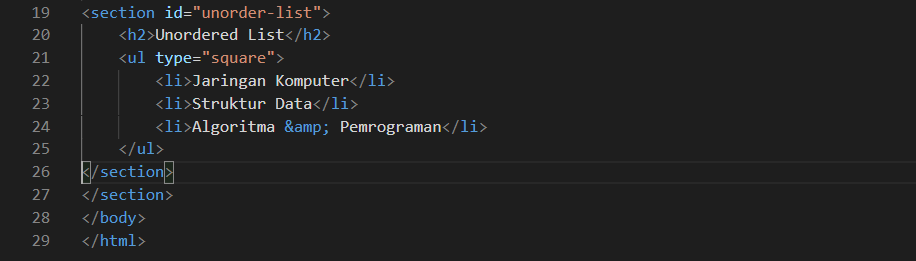
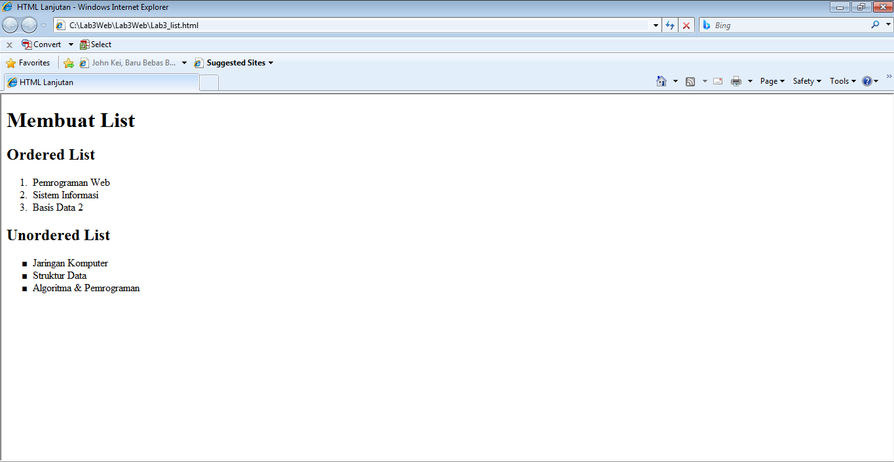

<strong> Membuat Description List </strong> 
Kemudian tambahkan kode untuk membuat description list setelah deklarasi unorderd-list.
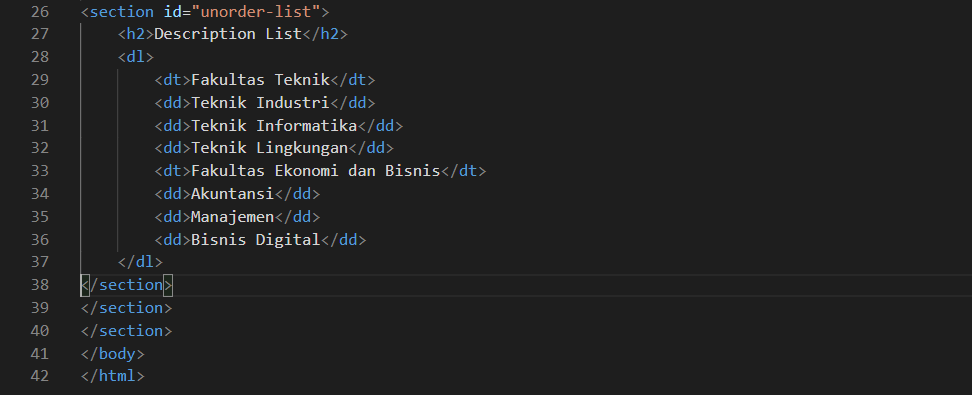
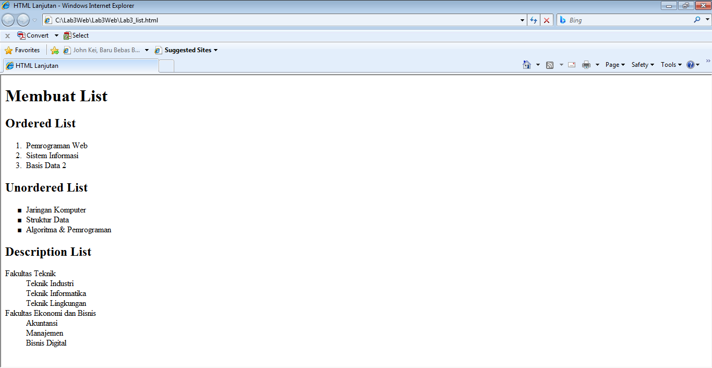

Selanjutnya lakukan eksperimen lain terkait list dan penggunaan atribut type pada list.
<strong> Membuat Tabel </strong>
Buat file baru dengan nama <strong> lab3_tabel.html </strong> seperti berikut.
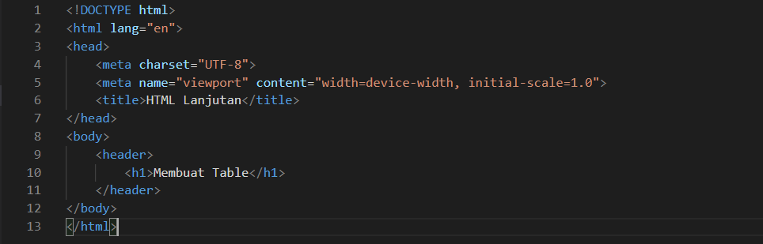

Kemudian selanjutnya tambahkan kode untuk membuat tabel sederhana seperti berikut:
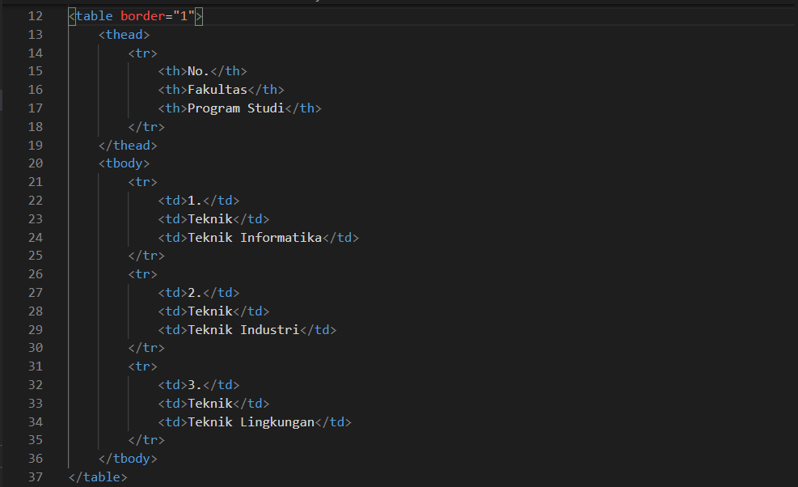
Ini hasil di Microsoft Edge nya
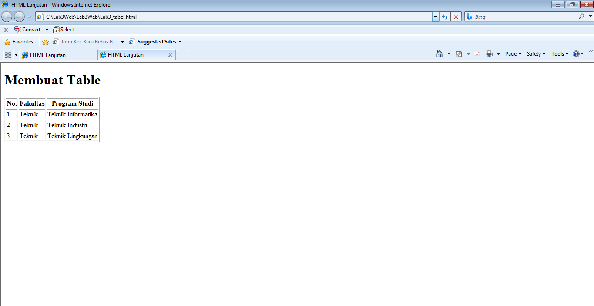

<strong> Mengatur Margin dan Padding </strong>
Untuk mengatur margin dan padding pada cel data, tambahkan atribut cellpadding dan cellspacing pada tag table.
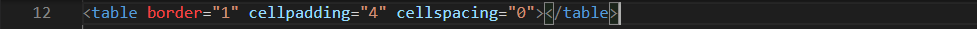
Ini hasil di Microsoft Edge nya
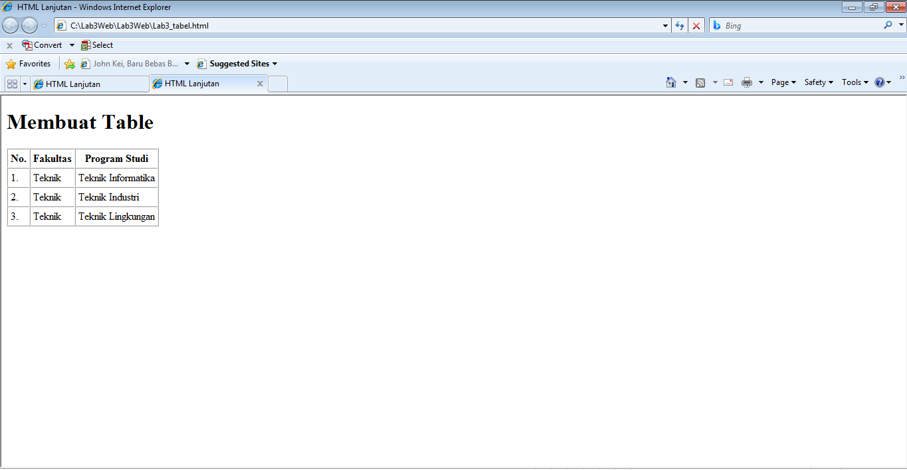

<strong> Menggabungkan Sel Data </strong>
Untuk menggabungkan sel data, gunakan atribut rowspan dan colspan. Atribut rowspan untuk
menggabungkan baris (secara vertikal) dan colspan untuk menggabungkan kolom (secara
horizontal).
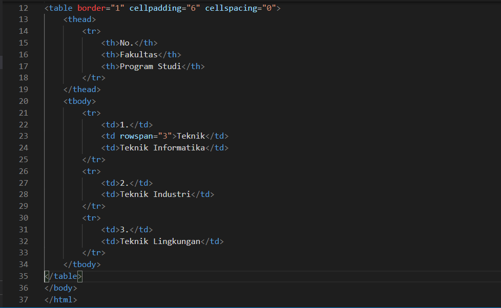
Ini hasil di Microsoft Edge nya
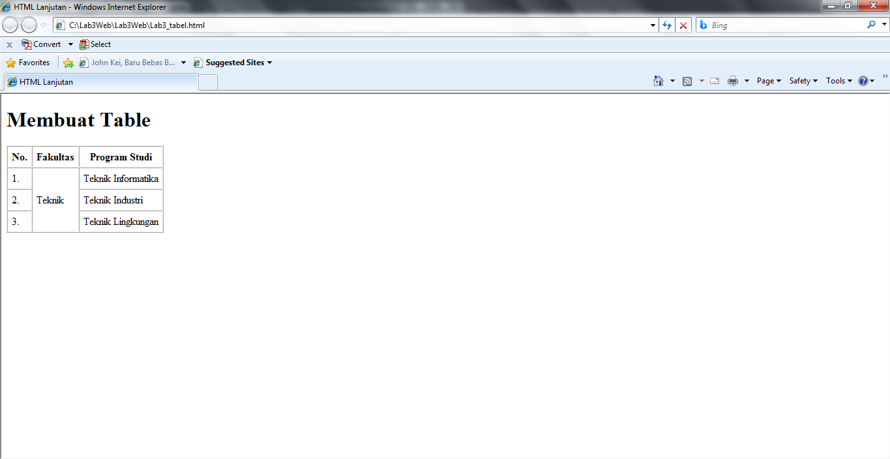

<strong> Membuat Form </strong>
Buat file baru dengan nama <strong> lab3_form.html </strong> seperti berikut.
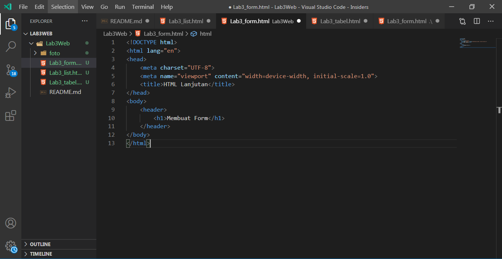

Kemudian selanjutnya tambahkan kode untuk membuat tabel sederhana seperti berikut:
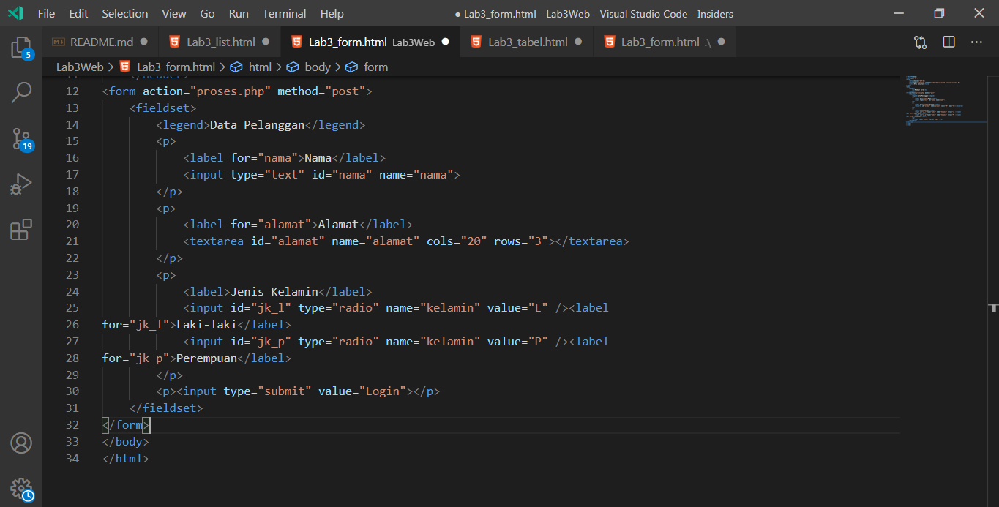
Ini hasil di Microsoft Edge nya
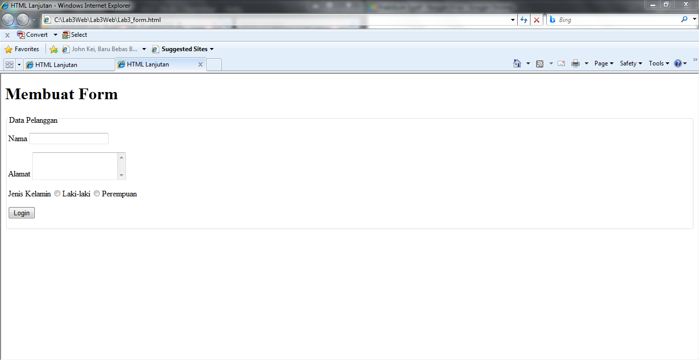s

<strong> Menabahkan Style pada Form </strong>
Agar tampilan form lebih menarik, bisa ditambahkan CSS seperti berikut.
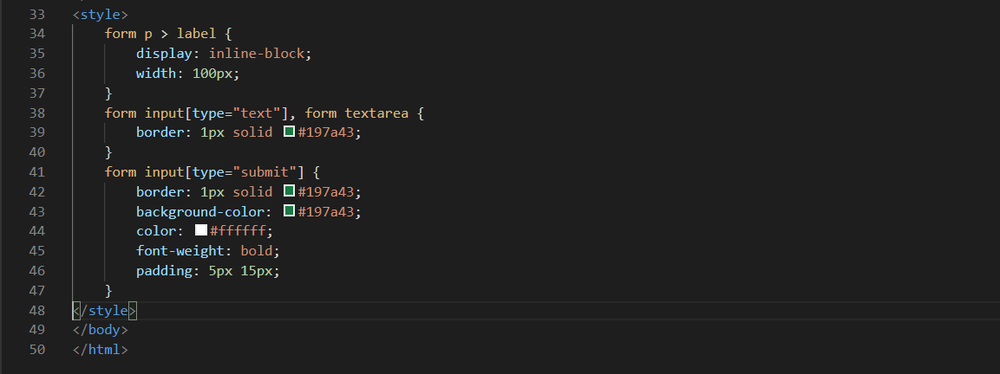
Ini hasil di Microsoft Edge nya
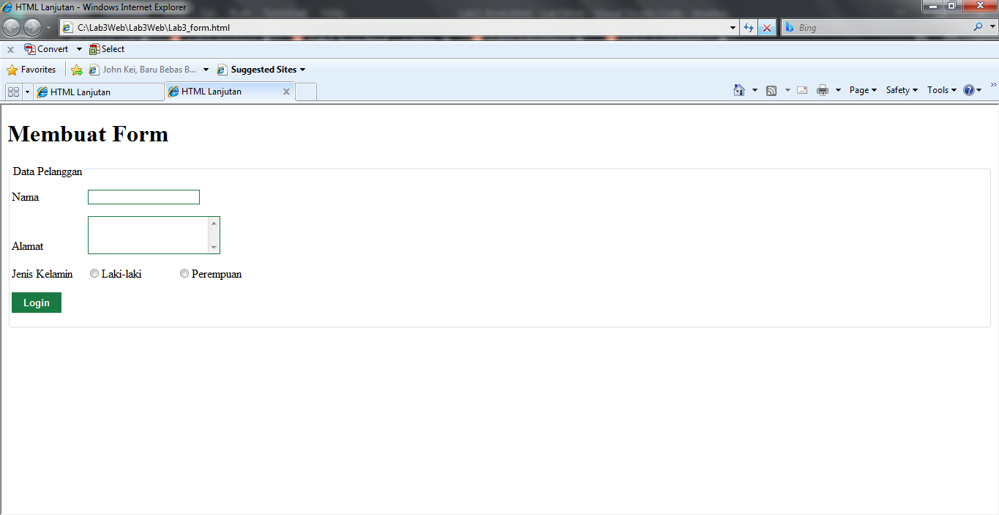

# Pertanyaan dan Tugas
1. Buatlah form yang menampilkan 'dropdown' menu dan 'listbox' dengan multiple selection.

## Jawab
Saya akan membuat dropdownmenu dan 'listbox' dengan multiple selection menggunakan VSC

1. Pertama-tama saya akan membuat file dengan nama Lab3_form-dropdown.html

2. Setelah itu saya akan membuat kerangka htmlnya

isi dari kerangka ada dropdown menu, kemudian h1, selanjutnya < form action="proses.php" method="post">, form ini menggunakan multiple selection. Gambarannya seperti berikut:

Dan ini kerangka css-nya

Dan inilah hasilnya
